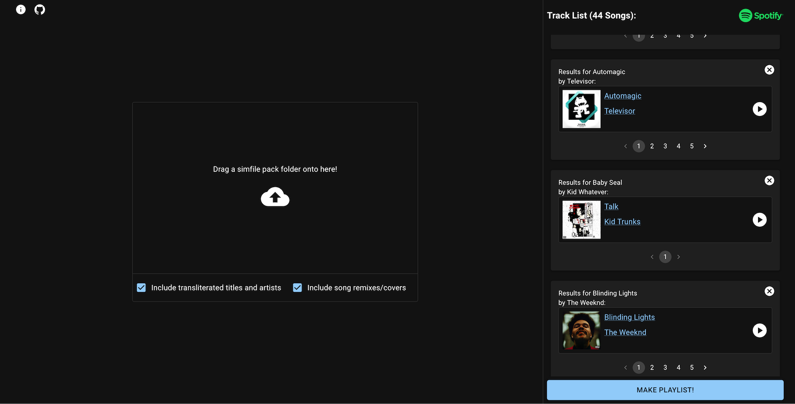
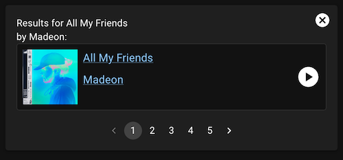
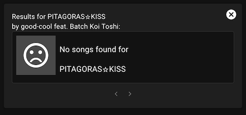
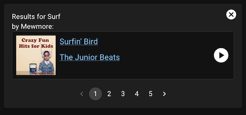
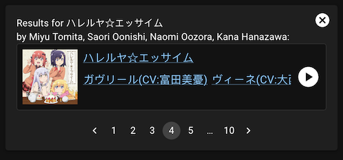
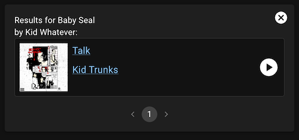

# sm-to-playlist

This is a fairly simple web application to build Spotify playlists from [Stepmania](https://github.com/stepmania/stepmania) stepfiles. Instead of spending an hour putting together a playlist by hand, I decided to spend ~~one weekend~~ ~~two weekends~~ a while building a tool to help me do it. It's built with [React](https://react.dev/) and [Spotify's Web API SDK](https://github.com/spotify/spotify-web-api-ts-sdk).

## How's it work



### The basic idea is:
- Allow the application access to your Spotify Account
- Drag a folder of Stepmania stepfiles onto the drop zone on the left
- Results for each stepfile will populate the Track List on the right, with
 the best matching tracks will be selected for each stepfile
- Go through the list and double check that the selected tracks are *actually* the best matches. Use the `<` and `>` buttons to select a different track, or click the `x` to remove that stepfile from the playlist.
- Click "Make a Playlist!", confirm the playlist name and privacy settings, and click "Create" to finalize creating the playlist

### A more detailed explanation of what's going on:


For each stepfile loaded, Spotify is searched for matching tracks. The results are compared with the stepfile's listed song title and artist, and are sorted from best to worst matching.

There are two options available for changing how search results are handled: "Include transliterated titles and artists", and "Include song remixes/covers".

When "Include transliterated titles and artists" is checked, a second search attempt is made using the stepfile's `#TITLETRANSLIT` and `#ARTISTTRANSLIT` (if present).

When "Include song remixes/covers" is checked, the requirements for matching artist names are relaxed. This can be useful if an exact version of a song isn't available on Spotify, but you'd still like to include some version of the song.

This comparison process turned out to be more complicated than I first expected. In a lot of cases, especially if the stepfile is for a popular song, the "best" match is the top result returned by Spotify. But differences between how Spotify and a stepfile list a song's title or artists make the process more difficult, and the top result returned from Spotify isn't always correct.

Common issues include things like:

- Stepfiles might list a featured artist as part of the song title: 
```
#TITLE:Something Real (feat. Danyka Nadeau);
#ARTIST:Rameses B;
```

- Artists might be listed in several different ways:

```
#ARTIST:Droptek & Vorso
...
#ARTIST:Dirtcaps x Gerald Le Funk
...
#ARTIST:DJ Ostkurve feat. David Hasselhoff;
...
#ARTIST:Deadmau5 ft. Wolfgang Gartner;
...
#ARTIST:Miyu Tomita, Saori Oonishi, Naomi Oozora, Kana Hanazawa;
```

- Song titles might include information (such as stepfiles from certain tournament packs):
```
#TITLE:[1372] [07] Beat Radiance (Medium);
```

To handle this, the search process has been broken into several steps
-  Sanitize the stepfile's title and artist, removing certain commonly seen patterns from the `#TITLE` and `#SUBTITLE` (if present), and splitting the `#ARTIST` by several common delimeters to produce a list of artists
- This sanitized data is used to search Spotify
- Then each result is scored for similarity using several different comparisons:
   - Spotify title compared to stepfile's title
   - Spotify title compared to stepfile title and subtitle (if present)
   - Spotify track's main artist compared to the first artist listed in the stepfile
   - Alphabetized list of Spotify track's artists compared to alphabetized list of stepfile artists
- These comparisons are made using a fairly simple [gestalt pattern matching](https://en.wikipedia.org/wiki/Gestalt_pattern_matching) algorithm, and weighted to try to reduce false positives
- Tracks that don't meet a minimum threshold score are discarded, and the rest are presented to the user so they can make the final selection.

### Known issues

Ideally, if the song exists on Spotify, it's returned as the first result:


And ideally, if a match for the song does not exist, a "no results" card is displayed:


But the scoring process is by no means perfect, and there are several situations where it still fails.

For example, it tends to fail if the specific song/artist combination aren't available on Spotify, but the song title is short or very common (especially if "Include song remixes/covers" is checked):



If "Include transliterated  titles and artists" is checked, results in non-English languages might get buried by English language tracks:


And sometimes, it's just...way off:


I suspect that a lot of these failures are due to limitations of the pattern matching algorithm I'm using. For short strings, any similarities end up with scoring relatively high, and most song titles tend to be pretty short.

### Cool, where can I check it out?
I'm still waiting on Spotify to approve the app for public use, but if/when it's approved, it will be available at [https://mjvotaw.github.io/sm-to-playlist/](https://mjvotaw.github.io/sm-to-playlist/)